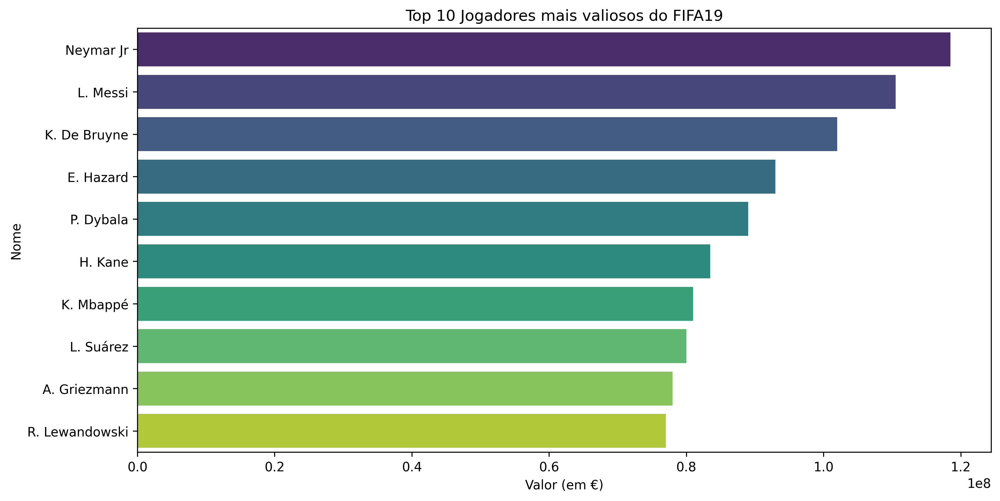
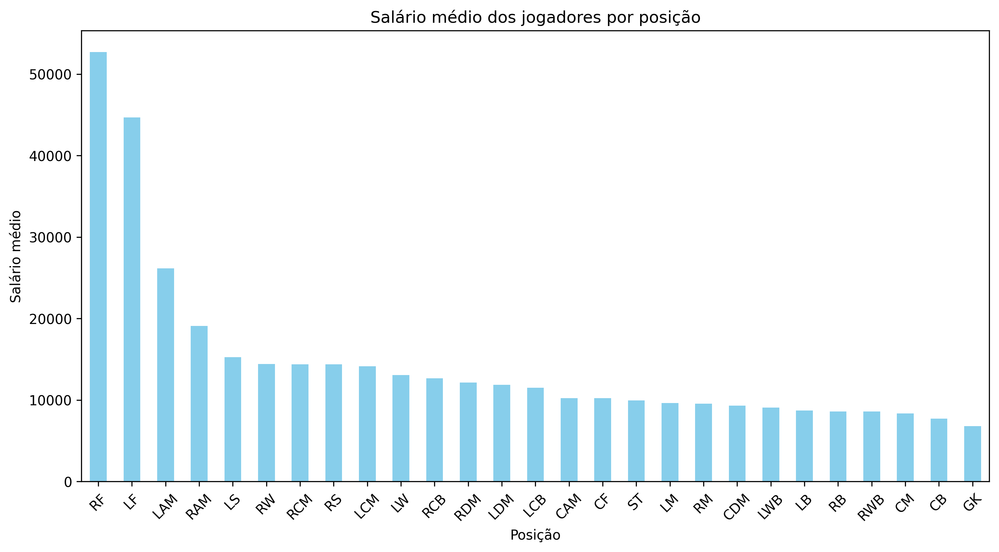

# 📊 Análise de Dados do FIFA 19

## 📌 Visão Geral
Este projeto tem como objetivo explorar e analisar o conjunto de dados do FIFA 19, extraído de um banco de dados público. Através de técnicas de **Análise de Dados** e **Feature Engineering**, buscamos insights relevantes sobre jogadores, clubes e ligas, preparando os dados para futuras aplicações de **Machine Learning**.

A motivação do uso deste dataset, foi devido ao meu primeiro artigo no Medium: [Qualquer semelhança é mera coincidência: SQL e Pandas.
](https://medium.com/@datapalacio/qualquer-semelhan%C3%A7a-%C3%A9-mera-coincid%C3%AAncia-sql-e-pandas-5b33c1551a23) A partir disso, utilizei algumas consultas semelhantes entre SQL e a bibloteca Pandas.

---
## 📂 Descrição do Dataset  
O conjunto de dados utilizado neste projeto é uma extração do FIFA 19, contendo informações detalhadas sobre jogadores, clubes e ligas. As principais colunas do dataset incluem:  

🔹 **ID & Name:** Identificação única e nome do jogador.  
🔹 **Age & Nationality:** Idade e nacionalidade do atleta.  
🔹 **Overall & Potential:** Avaliação atual e potencial máximo do jogador.  
🔹 **Club & League:** Clube e liga em que o jogador atua.  
🔹 **Value & Wage:** Valor de mercado e salário semanal do jogador.  
🔹 **Position & Jersey Number:** Posição principal e número da camisa.  
🔹 **Skills & Attributes:** Conjunto de características técnicas e físicas do jogador.  

📌 **Fonte:** Dataset público do FIFA 19, disponível no [Kaggle](https://www.kaggle.com/karangadiya/fifa19).  


---
## 📂 Estrutura do Projeto
```
📁 fifa19-analysis/
│── 📂 data/            # Dados utilizados ou link para download  
│── 📂 notebook/        # Jupyter Notebooks organizados  
│── 📂 reports/         # Relatórios ou imagens de gráficos  
│── 📄 README.md        # Descrição clara do projeto  
```

---

## 🔍 Limpeza e preparação dos dados
Antes de realizar qualquer análise, foi necessário um processo de **limpeza e tratamento dos dados** para garantir sua qualidade. As principais ações realizadas incluem:
- Exclusão de algumas colunas que era desnecessárias.
- Remoção dos símbolos monetários nas colunas `Wage`, `Value` e `Release Clause`, pois iriamos realizar análise estatistica com elas. 
```python
# Removendo simbolos monetários e convertendo para float

def remover_simbolos(valor):
    if isinstance(valor, float):
        return valor
    
    valor = valor.replace('€', '')

    if 'M' in valor:
        return float(valor.replace('M', '')) * 1000000
    if 'K' in valor:
        return float(valor.replace('K', '')) * 1000

    return float(valor)
```

### 🛠 Tratamento de dados ausentes
- Colunas com valores ausentes foram analisadas para decidir a melhor estratégia de imputação (remoção ou substituição com valores padrão).
- Para atributos categóricos, foi aplicada **imputação com valores mais frequentes**.

```python
# Contando a frequência de cada número de camisa por posição  
top_numbers = df_filtered.groupby('Position')['Jersey Number'].agg(lambda x: x.mode()[0]).reset_index()  
```

### 🔄 Normalização dos dados
- Colunas contendo valores monetários (como `Wage`, `Value` e `Release Clause`) foram convertidas de **strings para valores numéricos** para realizarmos calculos com elas, removendo símbolos como `€`, `K` e `M`.

### 🔢 Criação de novas variáveis (Feature Engineering)
- Adicionamos uma coluna `Champions` para indicar se o jogador nasceu em um país que já venceu a Copa do Mundo (Brasil, Alemanha, Itália, etc.), com encoding **0 (não) e 1 (sim)**.
```python
# Lista de países campeões do mundo
world_cup_winners = {"Brazil", "Germany", "Italy", "Argentina", "Uruguay", "France", "Spain", "England"}

# Criando a coluna "Champions" com encoding (1 para campeões, 0 para os demais)
fifa["Champions"] = fifa["Nationality"].apply(lambda x: 1 if x in world_cup_winners else 0)
fifa['Champions'] 
```

---

## ⚽ Análise Exploratória (EDA)

## 📌 Perguntas Analisadas  
Durante a análise exploratória, buscamos responder algumas perguntas-chave:  

✅ **Quais são os jogadores mais valiosos do jogo?**  



✅ **Como a idade impacta o desempenho (Overall) dos jogadores ao longo dos anos?**  


✅ **Quais clubes e ligas possuem os jogadores mais valiosos?** 


✅ **Existe um padrão nas numerações das camisas por posição?**  
```python
# Frequencia de número de camisa por posição 

# Selecionando apenas as colunas relevantes e remover valores ausentes  
df_filtered = fifa[['Jersey Number', 'Position']].dropna()  

# Contando a frequência de cada número de camisa por posição  
top_numbers = df_filtered.groupby('Position')['Jersey Number'].agg(lambda x: x.mode()[0]).reset_index()  
top_numbers.rename(columns={'Jersey Number': 'Top Jersey Number'}, inplace=True) # Renomeando a coluna para deixar mais claro

# Agrupando por 'Position' e 'Jersey Number' e contar o número de valores  
counts = df_filtered.groupby(['Position', 'Jersey Number']).size().reset_index(name='Count')  
```

✅ **O salário dos jogadores varia significativamente por posição?**  



---

## 📌 Conclusão
Este projeto fornece uma visão aprofundada dos jogadores do FIFA 19, utilizando técnicas de **limpeza de dados, engenharia de atributos e análise exploratória**. Além disso, os dados foram organizados para **previsões futuras com Machine Learning**, garantindo que estejam no formato ideal para modelos de aprendizado supervisionado e não supervisionado.

📢 **Próximos Passos:**
- Aplicar modelos de Machine Learning para prever o valor de mercado dos jogadores.
- Analisar o impacto de diferentes ligas no desenvolvimento dos atletas.
- Criar um sistema de recomendação de jogadores com base no desempenho.

---

## 🛠 Tecnologias Utilizadas
- **Python** (Pandas, NumPy, Matplotlib, Seaborn)
- **VS Code + Data_Wrangler** para análises e visualizações interativas
- **GitHub** para versionamento e compartilhamento do projeto

📌 **Autor:** *Gustavo Palacio*  
📅 **Data:** *Fevereiro de 2025*

---

## 📊 Próximas Análises Possíveis  
Além das análises já realizadas, algumas perguntas adicionais podem trazer novos insights:  

✅ **Idade x Performance:** Em que idade os jogadores atingem seu auge?  
✅ **Evolução Salarial por Posição:** Quais posições são mais valorizadas financeiramente?  
✅ **Impacto da Liga no Desenvolvimento:** Jogadores melhoram mais em algumas ligas específicas?  
✅ **Padrões de Transferências:** Quais países mais exportam jogadores para ligas europeias?  

---

## ⚙️ Possíveis Manipulações nos Dados  
Se precisar modificar ou enriquecer o dataset, algumas técnicas úteis incluem:  

📌 **Normalização:** Converter valores monetários para a mesma unidade (ex: milhões de euros).  
📌 **Agrupamento:** Criar categorias de jogadores por Overall (ex: estrelas, promessas, veteranos).  
📌 **Criação de Novas Features:** Adicionar colunas como "Idade na Copa do Mundo" ou "Histórico de Transferências".  
